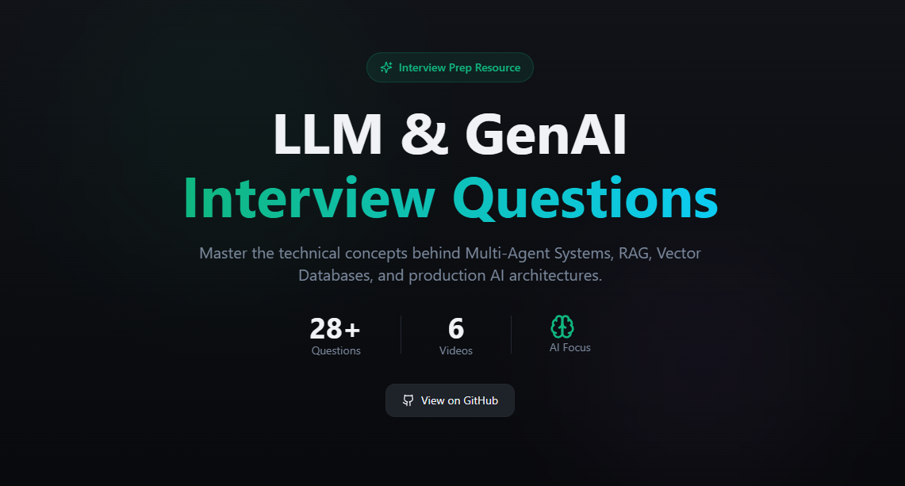

# AI Engineer Interview Questions

A curated collection of interview questions and answers for AI, GenAI, LLM, RAG, Agentic applications and more.

<https://llm-interview-questions.lovable.app/>

## Table of Contents

- [📚 View All Interview Questions](#-view-all-interview-questions)
  - [Multi-Agent Systems](./Interview_Questions.md#multi-agent-systems)
  - [Vector Databases & RAG](./Interview_Questions.md#vector-databases--rag)
  - [Cost Optimization](./Interview_Questions.md#cost-optimization)
  - [Error Handling & Edge Cases](./Interview_Questions.md#error-handling--edge-cases)
  - [Evaluation & Testing](./Interview_Questions.md#evaluation--testing)
  - [Miscellaneous](./Interview_Questions.md#miscellaneous)
  - [Customer Support Agent Interview Questions](./Interview_Questions.md#customer-support-agent-interview-questions)
- [🎨 System Design Diagrams](#-system-design-diagrams)
  - [AI System Design](#ai-system-design)
  - [System Design - AI Architecture](#system-design---ai-architecture)
- [Resources](#resources)
- [📖 About](#-about)
- [🤝 Contributing](#-contributing)

## 📚 [View All Interview Questions](./Interview_Questions.md)

Click the link above to access the complete list of questions and answers, organized by topic:

- **Multi-Agent Systems** - Architecture, context management, scaling, and production deployment
- **Vector Databases & RAG** - Search approaches, data storage, and optimization techniques
- **Cost Optimization** - Semantic caching and cost-saving strategies
- **Error Handling & Edge Cases** - User interruptions, infinite loops, and edge case management
- **Evaluation & Testing** - Agent evaluation, RAG evaluation, and testing methodologies

## 🎨 System Design Diagrams

### AI System Design

### System Design - AI Architecture

.png)

## Resources

 - https://www.anthropic.com/engineering/multi-agent-research-system

## 📖 About

I am maintaining this repo for myself as and when I learn new things. Many questions would be asked in an interview and many would be for learning.

## 🤝 Contributing

If you have something to add or correct, please raise a PR so it helps everyone.

Happy Learning !!

